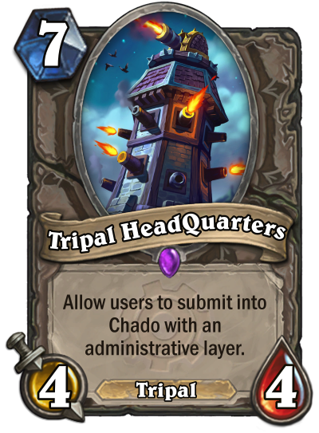

# Tripal HeadQuarters (HQ)

Tripal HQ provides a user-contributed content control center and administrative toolbox for your Tripal site.  This means that users are able to create whatever Chado content you'd like them, but withhold inserting it into the database until someone has approved it.

For module installation and usage instructions, [please see our documentation website](https://tripal-hq.readthedocs.io/en/latest/?badge=latest).

## Module Features

* Users create data using your existing Bundle configuration or Importers- no extra forms!
* User dashboard area for viewing pending submissions
* Admin dashboard for viewing submissions
* Chado-based permissions to create admins for certain projects or organisms

## Logo Credit

artist credit: Jason Kang, Copyright 2010-2018 Blizzard Entertainment
https://www.deviantart.com/kangjason/art/Hearthstone-BlackHowl-Gunspire-738554497
